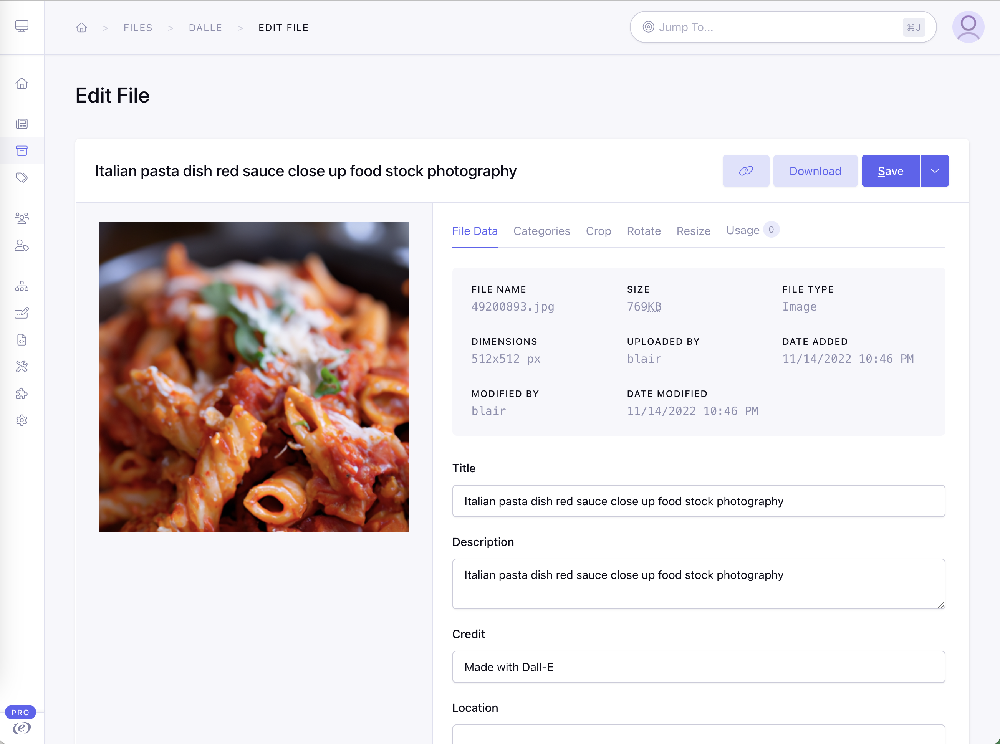
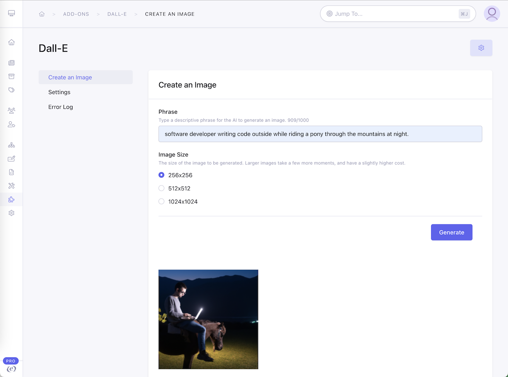
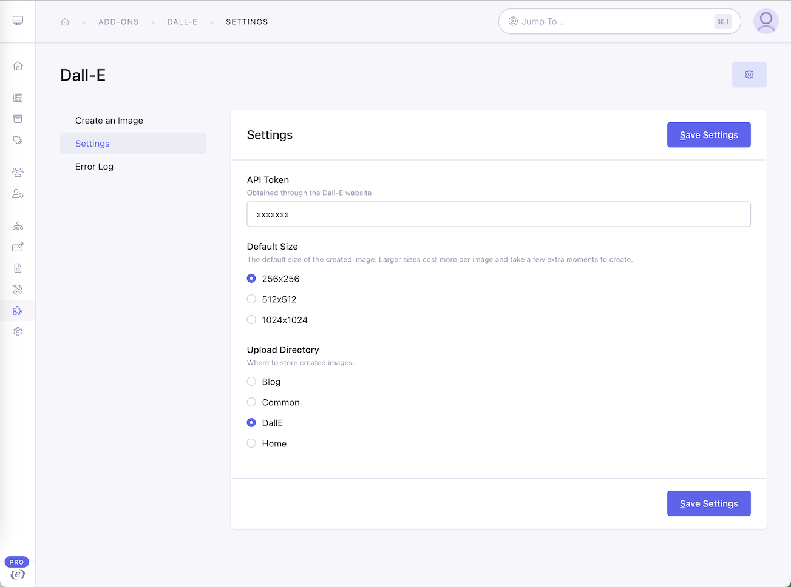

# dalle

ExpressionEngine add-on integration with Dall-E 2

Type in a phrase to have the Dall-E image AI generate an image, unique each time. Created images are automaticaly added to the EE file manager and phrases are cached.




## Install

- Install addon by copying the files to the add-on directory within a folder called `dalle`.
- Create an account at [beta.openai.com](https://beta.openai.com/) and generate an API secret key [beta.openai.com/account/api-keys](https://beta.openai.com/account/api-keys) At the time of this writing there were about $18 in free credits to create images.
- Add the key to the setting page, and set a file directory to put created images in.

- Either using a template tag or the add-on, type a phrase in to have Dall-e create an image and use it like a normal image through the file manager!

## Tag

Template tags are listed below.

```html
{exp:dalle:image
  phrase="software developer throwing a computer into a dumpster on fire like the movie office space"
}
  
{/exp:dalle:image}
```

Use with a custom text field we will just called `image_phrase`

```html
{exp:dalle:image
  phrase="{image_phrase}"
}
  
{/exp:dalle:image}
```

## Parameters

| Name | Description | Default |
| -----|-------------|---------|
| phrase | (Required) Text to describe the image to create.  Max 1,000 characters | empty |
| cache | When set to `true` will search the log for the most recent image generated from the exact phase. `false` will always generate a new image. | `true` |
| size | Size of the image to create.  Currently there are only 3 sizes.  Costs increase for larger images. | 256x256 |

## Tags

| Name | Description |
| -----|-------------|
| `url` | Returns the full path to the image from the file manager for the first image found. |
| `id` | The ID of the image in the file manager for passing onto another tag. |
| `phrase` | The phrase used to create the image. |
| `error` | Text of any errors that happen. Blank if none. |
